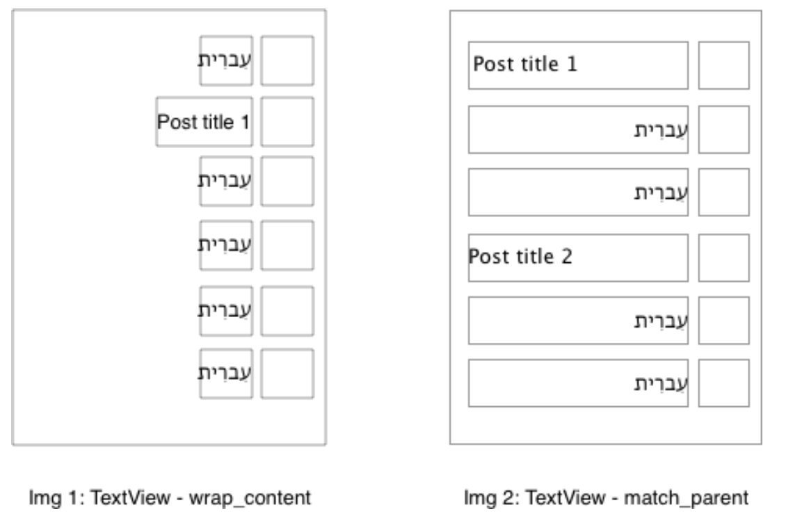

Supporting Right-to-Left text is quite straightforward as most issues are handled automatically by the Android OS or are guarded by lint. 

## Animations and Drawables

Whenever you add a new animation/drawable, consider whether it needs to be mirrored in RTL mode.

## Images/Icons

Writing direction also affects time flow direction -> some asymmetric images/icons, such as `reply` or `back`, need to be mirrored.

## Text alignment

In order to have consistencty on text aligment when suporting RTL locales keep in mind the following:

- Never test text using device developer setting: "Force RTL layout". It does not work well with `android:gravity="start"`. When testing we recomend setting your device language to an RTL locale such as Arabic or Hebrew. 
- The recomended way to align text on xml layout is using `gravity="start"`. Most of the defined styles for texts existing in the app already set gravity and textAligment. Example: 
```xml
<style name="Woo.TextView.Subtitle2">
    <item name="android:textAppearance">?attr/textAppearanceSubtitle2</item>
    <item name="android:textColor">@color/color_on_surface_medium</item>
    <item name="android:gravity">center_vertical|start</item>
    <item name="android:textAlignment">gravity</item>
</style>
```
- `android:textAlignment` has precedence over `android:gravity`. So avoid using `textAlignment="viewStart"` when defining styles. 
- Setting Arabic or Hebrew in Android Studio preview can be very convenient during development phases
- Android automatically mirrors layouts in RtL mode. In rare cases the default text alignment (which is derived from the text language) needs to be overridden to keep the UI look consistent.

> **Example**: Lists can possibly contain items in both English and Hebrew. When the title `TextView` width is set to `wrap_content`, everything is handled correctly (see Img 1). But if the title `TextView` width is set to `match_parent`, the UI can become disarranged (see Img 2).



* If using `ConstraintLayout`, set the view to `wrap_content`, and then use `app:layout_constrainedWidth="true"` along with `app:layout_constraintHorizontal_bias="0.0"`.
