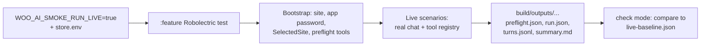

# Woo AI Smoke Architecture

This document explains how the Android AI Assistant headless smoke harness is built.
For commands and day-to-day use, see [Woo AI Smoke](woo-ai-smoke.md).

## Mental Model

A short orientation before any of the details:

- The harness is a Robolectric unit test in `:libs:ai-assistant:feature`. No Android device required.
- It opts in to a live run that talks to the real chat service and real Woo tool registry. Without the opt-in env var,
  the test skips.
- A second test runs in approval mode. Approval is the only path that produces a new baseline candidate.
- Live store credentials come from a file outside the repo (`~/.woo-ai-smoke/store.env`).
- Before any scenario runs, the harness bootstraps `SelectedSite` and application-password state, then runs a small set
  of read-only "preflight" tools so basic setup failures show up early.
- Every run writes JSON/Markdown artifacts under `build/outputs`. These are generated; they are never committed.
- The only checked-in piece is `live-baseline.json` under `src/debug/resources`. A developer updates it by hand.
- `:WooCommerce` keeps an optional device-backed adapter, but the primary success path is the Robolectric test.

## End-to-End Flow

A live run, in order:



The rest of the doc follows that order.

## 1. Entrypoints

| Test class | Module | Purpose |
| --- | --- | --- |
| `WooAiSmokeLiveRobolectricTest` | `:libs:ai-assistant:feature` (testDebug) | Default. Live run, compares to checked-in baseline. |
| `WooAiSmokeLiveRobolectricApprovalTest` | `:libs:ai-assistant:feature` (testDebug) | Live run that writes a baseline candidate. Used only when intentionally refreshing. |
| `WooAiSmokeAndroidTest` | `:WooCommerce` androidTest | Optional device adapter for an already-installed authenticated debug app. |

Both Robolectric tests check `WOO_AI_SMOKE_RUN_LIVE=true` via `WooAiSmokeLiveEnvRule` before Hilt injection. Without it
they skip by JUnit assumption, so the live Hilt graph is never built and no live network calls happen.

Splitting check and approval into two test classes prevents a normal run from accidentally rewriting the accepted
baseline.

## 2. Credentials

The harness will not pull live credentials from production storage. They must be provided explicitly.

- File: `~/.woo-ai-smoke/store.env`, kept outside the repo.
- Keys: `WOO_SITE_URL`, `WOO_SITE_ID`, `WOO_USERNAME`, `WOO_APP_PASSWORD`.
- Loaded into env vars before the test runs; consumed by `WooAiSmokeLiveEnvRule`.

For chat auth, `WooAiSmokeDirectJwtTokenProvider` (debug-only code in `:feature`) mints a smoke-only Jetpack AI JWT.
This avoids depending on production auth flows.

## 3. Hilt Test Graph

The tool stack expects bindings the app module normally provides (`Context`, `CoroutineDispatcher`, `UserAgent`,
`AppSecrets`, and so on). But `:libs:ai-assistant:feature` cannot depend on `:WooCommerce` — that would invert the
production dependency. So the feature module supplies a small test graph of its own.

Two test-only modules under `feature/src/testDebug` make this work:

- `WooAiSmokeFeatureRobolectricModule` includes the FluxC/Woo database and network modules, and swaps Volley's
  main-thread delivery for a direct executor so FluxC callbacks complete predictably under Robolectric.
- `WooAiSmokeFeatureAppBindingsModule` provides the app-level bindings the tool stack needs: unqualified `Context`,
  a `CoroutineDispatcher`, `UserAgent`, blank `AppSecrets`, a smoke-only `ApplicationPasswordsConfiguration`, and a
  no-op `AssistantTelemetryTracker`.

Production direction stays `:WooCommerce -> :libs:ai-assistant:feature -> :libs:ai-assistant:core`. There is no reverse
arrow.

## 4. Bootstrap and Preflight

`WooAiSmokeCredentialBootstrap` runs before any scenario. It:

1. Persists a `SiteModel` for the smoke store.
2. Stores application-password credentials for that site.
3. Sets `SelectedSite` to the smoke store.
4. Verifies the real `WooCommerceToolRegistry` is in place.
5. Executes a fixed set of read-only preflight tools:
   - `products_list`
   - `orders_list`
   - `orders_list` with pending-order arguments (reported under the name `orders_list_pending`)
   - `analytics_orders`

**Preflight enforcement.** Each call goes through `executePreflight`, which `require()`s `ToolResult.Success`. Any other
result — validation error, transport error, safety rejection, or timeout — throws and the scenarios never run. That
throw is the enforcement.

**`safeToolResults` is the report, not the enforcement.** After preflight finishes successfully, bootstrap records what
ran and what kind of result each call returned into `WooAiSmokePreflightReport`. That report is serialized as
`preflight.json`. The `safeToolResults` field is a list of `{ toolName, resultKind }` entries — a piece of report
metadata that lets a reviewer reading `preflight.json` see what preflight covered. It does not gate anything later in
the run.

```json
{
  "safeToolResults": [
    { "toolName": "products_list", "resultKind": "SUCCESS" },
    { "toolName": "orders_list", "resultKind": "SUCCESS" },
    { "toolName": "orders_list_pending", "resultKind": "SUCCESS" },
    { "toolName": "analytics_orders", "resultKind": "SUCCESS" }
  ]
}
```

Because bootstrap throws on the first non-success, every `safeToolResults` entry in a published `preflight.json` will
be `SUCCESS`. The field exists for traceability, not control flow.

## 5. Scenarios

Once bootstrap returns, `WooAiSmokeRunner` reads `live-scenarios.json` from the feature module's `debug` resources and
runs each scenario against:

- the real `JetpackAiChatService` for chat completion,
- the real `WooCommerceToolRegistry` for any tool calls the model makes.

Each scenario also defines hard checks (structural assertions about the model's tool usage and final answer). They run
after the scenario completes. Turn-by-turn output is redacted before it reaches disk.

## 6. Artifacts and Baseline

Every run writes to two directories under the feature module's `build/outputs`:

```text
libs/ai-assistant/feature/build/outputs/woo-ai-smoke/live/latest
libs/ai-assistant/feature/build/outputs/woo-ai-smoke/live/runs/<yyyyMMdd-HHmmss>-<shortRunId>
```

Files written there:

| File | What it is |
| --- | --- |
| `preflight.json` | Bootstrap report, including `safeToolResults`. |
| `run.json` | Per-scenario results and hard-check outcomes. |
| `turns.jsonl` | Redacted turn-by-turn trace of chat and tool calls. |
| `summary.md` | Human-readable run summary. |
| `baseline-comparison.json` | Diff against the checked-in baseline (check mode). |
| `approved-live-baseline.json` | Baseline candidate (approval mode only). |

**These files are generated. They live under `build/`, they are not source code, and they are not committed.**

The only checked-in expectation is:

```text
libs/ai-assistant/feature/src/debug/resources/woo-ai-smoke/live-baseline.json
```

A developer updates that file by hand after reviewing an approval run's `approved-live-baseline.json`:

```bash
cp \
  libs/ai-assistant/feature/build/outputs/woo-ai-smoke/live/latest/approved-live-baseline.json \
  libs/ai-assistant/feature/src/debug/resources/woo-ai-smoke/live-baseline.json
```

Tests never write into `src/`.

## 7. Check Mode vs Approval Mode

- **Check mode** (`WOO_AI_SMOKE_MODE=check`, the default): runs the live scenarios and compares results to
  `live-baseline.json`. Fails on mismatch. Fails with "Live baseline approval required" if the baseline is missing or
  stale.
- **Approval mode** (`WOO_AI_SMOKE_MODE=approve`): runs the live scenarios and writes `approved-live-baseline.json`
  under `build/outputs`. Does not touch the checked-in baseline.

The two modes are wired to different test classes so a normal run cannot accidentally produce an approved baseline.

## What a Passing Live Run Proves

A green primary live run proves the Android AI Assistant runtime can, without a device or UI:

- accept explicit smoke credentials,
- mint a smoke-only Jetpack AI JWT,
- bootstrap `SelectedSite` and application-password state under Robolectric,
- run the real `JetpackAiChatService`,
- exercise the real `WooCommerceToolRegistry`,
- match canonical merchant scenarios and hard checks against the checked-in baseline.

It does not prove full app-launch behavior. That is the role of the optional `:WooCommerce` device-backed adapter.
