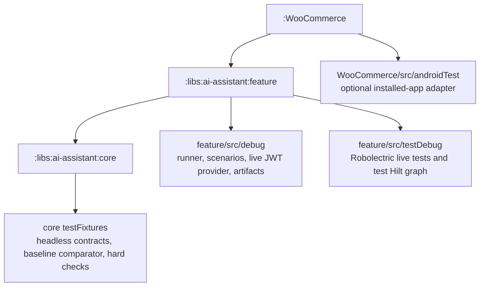
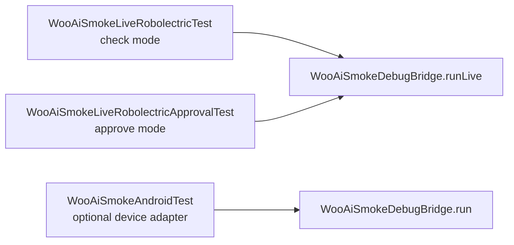
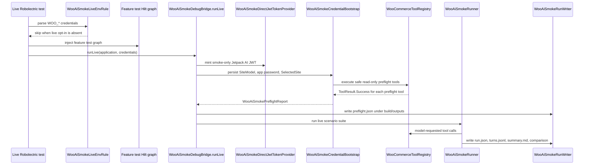
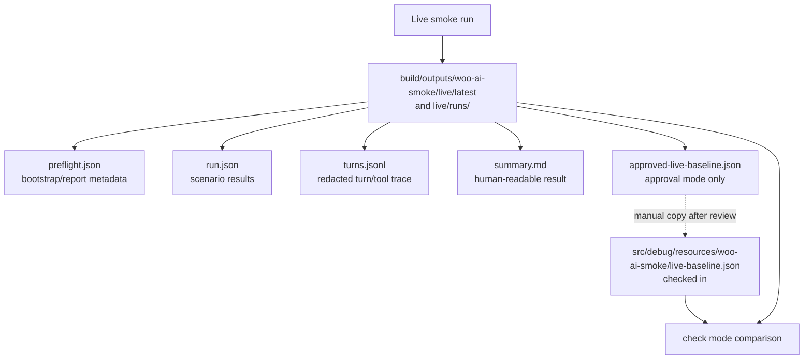
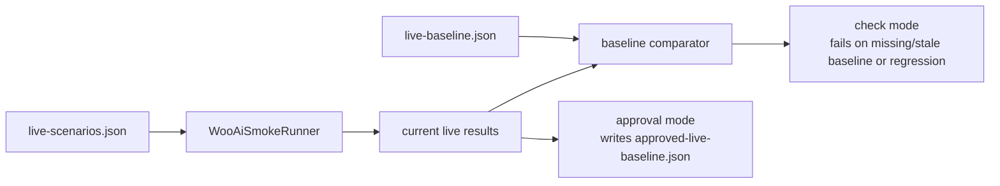

# Woo AI Smoke Architecture

This document explains the Android AI Assistant headless smoke harness after the primary no-device path moved into
`:libs:ai-assistant:feature`.

## Overview

**Why this exists**

The harness is meant to catch regressions in the live AI Assistant path without launching the app UI or requiring an
Android device. Deterministic fake-site tests are still useful for unit coverage, but they do not prove that the assistant
can talk to the real chat service, mint a real smoke JWT, bootstrap Android store state, and execute the real Woo tool
registry.

**How it works**

- The primary harness is a Robolectric unit test in `:libs:ai-assistant:feature`.
- It reads explicit smoke-store credentials from `~/.woo-ai-smoke/store.env`.
- It mints a smoke-only Jetpack AI JWT through debug/test code.
- It bootstraps `SelectedSite` and application-password state in a feature-owned Hilt test graph.
- It runs the real `JetpackAiChatService` and real `WooCommerceToolRegistry`.
- It writes review artifacts under `build/outputs`; tests do not edit source files.
- The checked-in baseline changes only when a developer intentionally copies an approved generated baseline into
  `src/debug/resources`.

## Module Ownership

**Why this boundary exists**

AI Assistant code should live with the AI Assistant modules. Keeping the primary no-device harness in `:feature` avoids
making `:WooCommerce` own a local-unit test graph purely for assistant smoke coverage. It also preserves the production
dependency direction: app module depends on assistant feature, not the other way around.

**How it is organized**



`:WooCommerce` is not the primary no-device harness anymore. It keeps only optional installed-app/device coverage through
`WooAiSmokeAndroidTest`.

## Test Entrypoints

**Why there are multiple entrypoints**

The live smoke harness has two primary no-device workflows: normal regression checking and intentional baseline approval.
The optional device adapter exists for a different purpose: validating an already installed, authenticated debug app and
its selected-site state.

**How the entrypoints map to runtime code**



Primary commands:

```bash
WOO_AI_SMOKE_RUN_LIVE=true WOO_AI_SMOKE_MODE=check \
  ./gradlew :libs:ai-assistant:feature:testDebugUnitTest \
    --tests "*.WooAiSmokeLiveRobolectricTest"

WOO_AI_SMOKE_RUN_LIVE=true WOO_AI_SMOKE_MODE=approve \
  ./gradlew :libs:ai-assistant:feature:testDebugUnitTest \
    --tests "*.WooAiSmokeLiveRobolectricApprovalTest"
```

The optional `:WooCommerce` instrumentation adapter is secondary evidence, not the default success path.

## Live Robolectric Flow

**Why the flow has explicit phases**

The harness needs failures to be attributable. A live failure could come from missing credentials, JWT minting, selected
site bootstrap, application-password state, tool execution, model output, hard-check evaluation, or baseline comparison.
The flow separates these phases so artifacts and failure messages point to the failing layer.

**How a check or approval run executes**



The env rule runs before Hilt injection. Without `WOO_AI_SMOKE_RUN_LIVE=true`, the live tests skip by JUnit assumption and
do not build the live graph.

## Feature Test Hilt Graph

**Why the feature test graph exists**

The production app Hilt graph supplies bindings that the assistant tool stack expects, but `:feature` cannot import
`:WooCommerce`. The feature test graph provides only the app-level pieces needed to run the real assistant and tool stack
under Robolectric.

**How the graph is assembled**

`WooAiSmokeFeatureRobolectricModule` includes the FluxC/Woo database and network modules required by the tool stack. It
also includes `WooAiSmokeRobolectricNetworkModule`, which replaces Volley delivery with a direct executor so FluxC network
callbacks complete predictably under Robolectric.

`WooAiSmokeFeatureAppBindingsModule` provides the small set of app-level bindings needed by the feature graph:

- unqualified `Context`;
- `CoroutineDispatcher`;
- `UserAgent`;
- blank `AppSecrets`;
- smoke-only `ApplicationPasswordsConfiguration`;
- no-op `AssistantTelemetryTracker`.

The dependency direction remains:

```text
:WooCommerce -> :libs:ai-assistant:feature -> :libs:ai-assistant:core
```

There is no dependency from `:libs:ai-assistant:feature` back to `:WooCommerce`.

## Bootstrap And Preflight

**Why bootstrap exists**

The model scenarios should run against the same Android data-layer assumptions as production tools: a selected site,
application-password credentials, and a real Woo tool registry. Bootstrap creates that state before the model sends any
prompt. It also runs a small set of safe read-only tools first, so a scenario failure is less likely to hide a basic site
or tool-stack setup problem.

**How bootstrap prepares the run**

Bootstrap does the following before scenarios run:

1. persist a `SiteModel` for the smoke site;
2. store application-password credentials for that site;
3. set `SelectedSite`;
4. verify the real `WooCommerceToolRegistry`;
5. execute safe read-only preflight tools:
   - `products_list`;
   - `orders_list`;
   - `orders_list` with pending-order arguments, reported as `orders_list_pending`;
   - `analytics_orders`.

Each preflight tool must return `ToolResult.Success`. If one does not, bootstrap fails and the live scenarios do not run.

`safeToolResults` is part of `WooAiSmokePreflightReport`. It is report data written into `preflight.json`; it records which
preflight tools ran and what result kind they returned.

```json
{
  "safeToolResults": [
    { "toolName": "products_list", "resultKind": "SUCCESS" },
    { "toolName": "orders_list", "resultKind": "SUCCESS" },
    { "toolName": "orders_list_pending", "resultKind": "SUCCESS" },
    { "toolName": "analytics_orders", "resultKind": "SUCCESS" }
  ]
}
```

The enforcement is the preflight execution itself. `safeToolResults` does not drive later control flow; it makes the
generated report explain what the preflight phase proved.

## Artifacts And Baseline

**Why artifacts are separate from the checked-in baseline**

A live smoke run produces evidence that reviewers need to inspect, but most of that evidence is run-specific and should
not be committed. The checked-in baseline is the stable expected result for check mode. Keeping generated artifacts under
`build/outputs` prevents tests from silently editing source files.

**How artifacts and baseline files move**



Generated artifacts live under:

```text
libs/ai-assistant/feature/build/outputs/woo-ai-smoke/live/latest
libs/ai-assistant/feature/build/outputs/woo-ai-smoke/live/runs/<yyyyMMdd-HHmmss>-<shortRunId>
```

These generated files are not source code and are not committed.

The checked-in live baseline is:

```text
libs/ai-assistant/feature/src/debug/resources/woo-ai-smoke/live-baseline.json
```

Approval mode writes `approved-live-baseline.json` into `build/outputs`. A developer updates the checked-in baseline only
by manually copying that generated file into `src/debug/resources` after review.

## Check Mode Versus Approval Mode

**Why there are two modes**

Check mode is for regression detection. Approval mode is for intentionally refreshing expected live behavior after a
reviewer decides the new live output is acceptable. Separating the modes prevents a normal test run from rewriting the
accepted baseline.

**How the modes differ**



Check mode compares current live results to the checked-in `live-baseline.json`. Approval mode writes
`approved-live-baseline.json` under `build/outputs`, and a developer copies it into `src/debug/resources` only after review.

## What The Harness Proves

**Why this distinction matters**

The harness is deliberately headless. It should prove the assistant runtime and tool stack work without device friction,
but it should not be mistaken for a full app launch or UI integration test.

**How to interpret a passing run**

A passing primary live run proves the Android assistant can run without UI or device while using:

- explicit live smoke credentials;
- the debug-only direct Jetpack AI JWT provider;
- real `JetpackAiChatService`;
- real `WooCommerceToolRegistry`;
- real FluxC/Woo stores and application-password state;
- canonical merchant scenarios and hard checks;
- redacted run artifacts for review.

It does not prove full app launch behavior. That remains the role of the optional `:WooCommerce` device-backed adapter.
