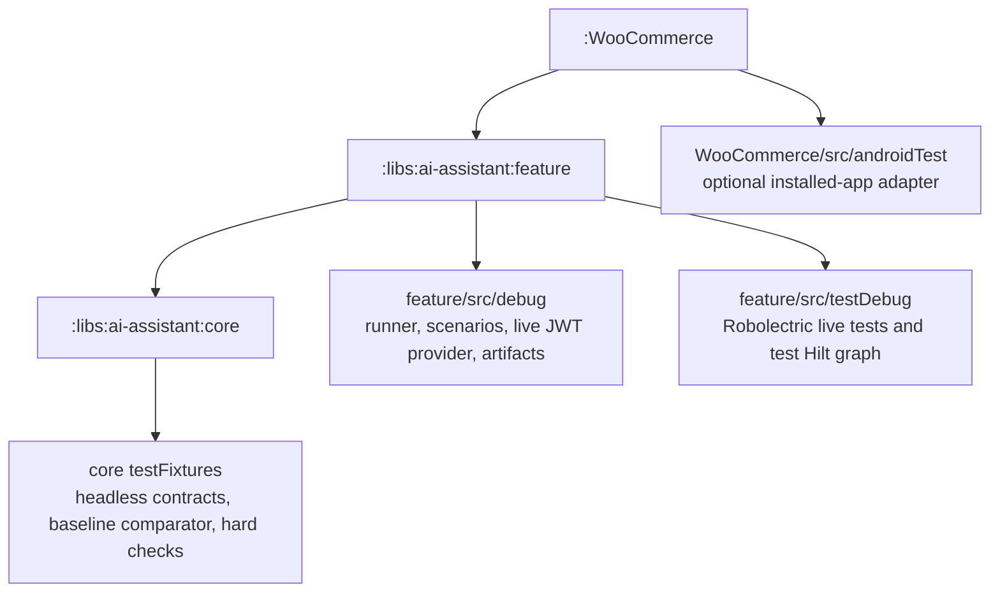
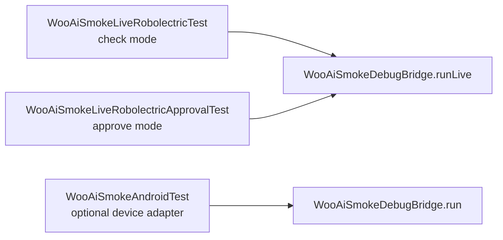
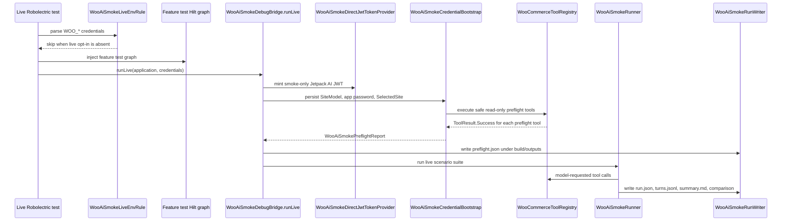
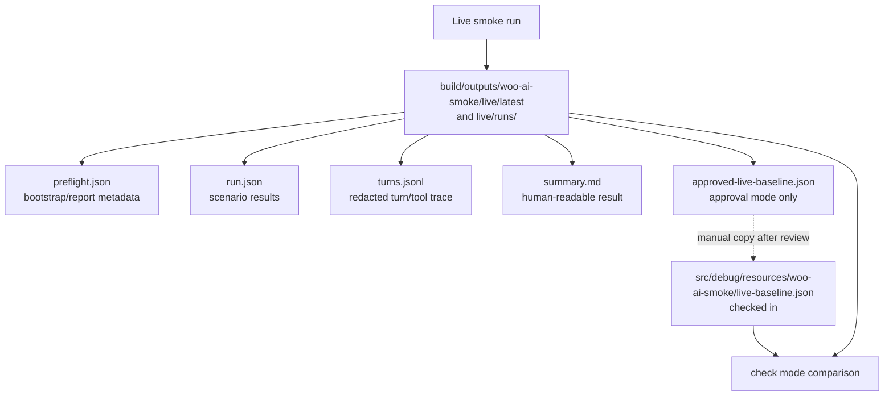
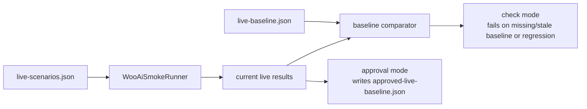

# Woo AI Smoke Architecture

This document explains the Android AI Assistant headless smoke harness after the primary no-device path moved into
`:libs:ai-assistant:feature`.

The short version:

- The primary harness is a Robolectric unit test in `:libs:ai-assistant:feature`.
- It does not launch UI and does not require a device.
- It uses explicit smoke-store credentials from `~/.woo-ai-smoke/store.env`.
- It runs the real `JetpackAiChatService` and real `WooCommerceToolRegistry`.
- It writes review artifacts under `build/outputs`; tests do not edit source files.
- The checked-in baseline changes only when a developer intentionally copies an approved generated baseline into
  `src/debug/resources`.

## Module Ownership



`:WooCommerce` is not the primary no-device harness anymore. It keeps only optional installed-app/device coverage through
`WooAiSmokeAndroidTest`.

## Test Entrypoints



Primary commands:

```bash
WOO_AI_SMOKE_RUN_LIVE=true WOO_AI_SMOKE_MODE=check \
  ./gradlew :libs:ai-assistant:feature:testDebugUnitTest \
    --tests "*.WooAiSmokeLiveRobolectricTest"

WOO_AI_SMOKE_RUN_LIVE=true WOO_AI_SMOKE_MODE=approve \
  ./gradlew :libs:ai-assistant:feature:testDebugUnitTest \
    --tests "*.WooAiSmokeLiveRobolectricApprovalTest"
```

The optional device-backed adapter remains useful when someone wants to validate an installed authenticated debug app and
its selected-site state, but it is not the primary evidence path.

## Live Robolectric Flow



The env rule runs before Hilt injection. Without `WOO_AI_SMOKE_RUN_LIVE=true`, the live tests skip by JUnit assumption and
do not build the live graph.

## Feature Test Hilt Graph

The feature module cannot import app modules. The live Robolectric graph therefore has feature-owned test modules:

- `WooAiSmokeFeatureRobolectricModule`
  - includes the FluxC/Woo database and network modules needed by the tool stack;
  - includes `WooAiSmokeRobolectricNetworkModule`, which replaces Volley delivery with a direct executor for Robolectric.
- `WooAiSmokeFeatureAppBindingsModule`
  - provides app-level bindings that the feature graph needs in tests:
    - unqualified `Context`;
    - `CoroutineDispatcher`;
    - `UserAgent`;
    - blank `AppSecrets`;
    - smoke-only `ApplicationPasswordsConfiguration`;
    - no-op `AssistantTelemetryTracker`.

This keeps dependency direction intact:

```text
:WooCommerce -> :libs:ai-assistant:feature -> :libs:ai-assistant:core
```

There is no dependency from `:libs:ai-assistant:feature` back to `:WooCommerce`.

## Bootstrap And Preflight

Bootstrap prepares Android data-layer state before the model scenarios run:

1. persist a `SiteModel` for the smoke site;
2. store application-password credentials for that site;
3. set `SelectedSite`;
4. verify the real `WooCommerceToolRegistry`;
5. execute safe read-only preflight tools:
   - `products_list`;
   - `orders_list`;
   - `orders_list` with pending-order arguments, reported as `orders_list_pending`;
   - `analytics_orders`.

The important behavioral check is inside `executePreflight`: every preflight tool must return `ToolResult.Success`. If one
does not, bootstrap fails and the live scenarios do not run.

`safeToolResults` is part of `WooAiSmokePreflightReport`. It records the preflight tool names and result kinds in
`preflight.json` so the generated artifact shows which real read-only tools were executed before the scenario run.

```json
{
  "safeToolResults": [
    { "toolName": "products_list", "resultKind": "SUCCESS" },
    { "toolName": "orders_list", "resultKind": "SUCCESS" },
    { "toolName": "orders_list_pending", "resultKind": "SUCCESS" },
    { "toolName": "analytics_orders", "resultKind": "SUCCESS" }
  ]
}
```

This field is report data. The enforcement is the preflight execution itself; the field is not used to decide later control
flow.

## Artifacts And Baseline



Generated artifacts live under:

```text
libs/ai-assistant/feature/build/outputs/woo-ai-smoke/live/latest
libs/ai-assistant/feature/build/outputs/woo-ai-smoke/live/runs/<yyyyMMdd-HHmmss>-<shortRunId>
```

These generated files are not source code and are not committed.

The checked-in live baseline is:

```text
libs/ai-assistant/feature/src/debug/resources/woo-ai-smoke/live-baseline.json
```

Approval mode writes `approved-live-baseline.json` into `build/outputs`. A developer updates the checked-in baseline only
by manually copying that generated file into `src/debug/resources` after review.

## Check Mode Versus Approval Mode



Check mode is the normal regression gate. Approval mode is only for intentionally refreshing the expected live baseline.

## What The Harness Proves

The primary live path proves the Android assistant can run without UI or device while using:

- explicit live smoke credentials;
- the debug-only direct Jetpack AI JWT provider;
- real `JetpackAiChatService`;
- real `WooCommerceToolRegistry`;
- real FluxC/Woo stores and application-password state;
- canonical merchant scenarios and hard checks;
- redacted run artifacts for review.

It does not prove full app launch behavior. That remains the role of the optional `:WooCommerce` device-backed adapter.
