# Woo AI Smoke Architecture

This document explains how the Android AI Assistant headless smoke harness is built and why it
splits into the levels you see. For commands and day-to-day use, see [Woo AI Smoke](woo-ai-smoke.md).

## Mental model

A short orientation before any of the details:

- A single loop harness, **`WooAssistantHeadless`** (in `:libs:ai-assistant:core` `testFixtures`),
  is the only thing that actually runs the agentic loop in tests. Everything else either drives
  the harness with a different chat/tool/runtime combination, or pins a contract that the harness
  produces (run result) or consumes (baseline JSON).
- That single harness is shared across **four levels of headless tests**, from "pure JVM scripted"
  to "real Robolectric live run against the real woo-mobile-ai WPCOM wrapper". Levels differ only in what gets
  injected (chat service, tool registry, runtime). See the level matrix in
  [Woo AI Smoke § Shared mental model](woo-ai-smoke.md#shared-mental-model-wooassistantheadless).
- The accepted **primary path** is a live no-device Robolectric test in `:libs:ai-assistant:feature`.
  `:WooCommerce` does not own a device-backed smoke adapter anymore — the live headless path lives
  entirely in the feature module.
- Live runs opt in with the per-command Gradle property `-PwooAiSmokeRunLive=true`. Without that
  opt-in, live tests skip via JUnit assumption — the Hilt graph is never built and no live network
  calls happen. If the property is present but credentials are missing or malformed, the test fails
  loudly instead of skipping.
- A second test class runs in approval mode. Approval is the **only** path that produces a new
  baseline candidate.
- Live store credentials come from a file outside the repo (`~/.woo-ai-smoke/store.env`).
- Before any scenario runs, the harness bootstraps `SelectedSite` and WPCOM REST Jetpack-connected selected-site state,
  then runs a small set of read-only "preflight" tools so basic setup failures show up early.
- Every run writes JSON/Markdown artifacts under `build/outputs`. These are **generated**; they are
  never committed.
- The only checked-in expectation is `live-baseline.json` under `src/testDebug/resources`. A developer
  updates it by hand after reviewing an approval run's `approved-live-baseline.json`.

## Why this layout

A fully live run is the only thing that proves the assistant actually works against the real model
and a real store. But a fully live run is expensive, slow, requires secrets, and is non-deterministic.
So the harness is decomposed into levels that each pay back a different kind of assurance:

| Level | Pays back | Cost |
| --- | --- | --- |
| 1. Core unit | Harness contracts and supporting types are well-defined | Seconds, no env |
| 2. Feature support | `WooAiSmokeRunner` glue (scenario mapper, run writer, redactor, direct hard-check failure) works end to end against the same harness Level 3 uses | Seconds, no env |
| 3. Live no-device | The real WPCOM wrapper chat service, AccountStore auth, WPCOM site resolution, tool registry, and merchant scenarios still match the accepted baseline | Minutes, needs credentials |
| 4. Live approval | A new baseline candidate, ready for human review | Same as Level 3 |

Level 2 is deliberately not authoritative — it can pass while the live model has drifted or a real
tool is broken. It is fast harness-wiring evidence. Level 3 is the merge-blocking gate.

## End-to-end flow (live runs)

A live run, in order:

```mermaid
flowchart LR
    Env["-PwooAiSmokeRunLive=true\n+ store.env"] --> Test[":feature Robolectric test"]
    Test --> Auth["WordPress.com auth:\nAccountStore"]
    Auth --> Resolve["Resolve site id:\n/me/sites"]
    Resolve --> Boot["Bootstrap:\nSelectedSite + preflight tools"]
    Boot --> Scen["Live scenarios:\nreal chat + tool registry\n(via WooAssistantHeadless)"]
    Scen --> Out["build/outputs/...\npreflight.json, run.json,\nturns.jsonl, summary.md"]
    Out --> Cmp["check mode: compare to\nlive-baseline.json"]
```



Level 2 follows the same flow from "Test" onward — but with fake chat and fake tool registry, no
opt-in env, no bootstrap, no baseline comparison, and a stable
`build/outputs/woo-ai-smoke/latest` directory.

## 1. `WooAssistantHeadless`: the shared loop harness

Lives in `:libs:ai-assistant:core` `testFixtures` so it can be consumed by:

- `:core` test sources (Level 1), built-in to the same module.
- `:feature` test sources, via `testImplementation(testFixtures(project(":libs:ai-assistant:core")))`
  so Level 2 tests (`WooAiSmokeDeterministicSupportTest`, `WooMobileAiChatServiceHeadlessHarnessTest`)
  and the Level 3/4 Robolectric tests can use it directly.

Given a `HeadlessScenario` and a `SessionContext`, the harness constructs an `AgenticLoopImpl` per
turn, drives it via the injected `ChatService`, lets the injected `ToolRegistry` answer tool calls,
and returns a `HeadlessRunResult` (assistant text, tool-call traces, confirmation requests and
results, errors). The harness exists so that every level executes the *same* loop, with the *same*
trace shape — so a scenario diff between Level 2 and Level 3 reflects real chat/tool behavior, not
plumbing drift.

`WooAiSmokeRunner` (in `feature/src/test/kotlin/.../headless`) is the entry point Levels 2–4 call
via `run()`. Internally it constructs a fresh `WooAssistantHeadless` and injects whichever
`ChatService` and `ToolRegistry` the level selects, plus a
`ScriptedHeadlessSafetyOrchestrator(default = CANCELLED)` so unsafe writes that the model attempts
are recorded and rejected unless the scenario explicitly accepts them.

The parser/comparator/hard-check evaluator under `:core` are independent: they pin the contracts
the harness produces and consumes, but they do not instantiate the harness. They keep the harness
honest from the side.

## 2. Entrypoints

| Test class | Module | Source set | Purpose |
| --- | --- | --- | --- |
| `WooAssistantHeadlessTest` | `:libs:ai-assistant:core` | `src/test` | Level 1. Pins the harness contract with scripted chat + recording fake registry. |
| `Headless{Baseline,HardCheck}*Test` | `:libs:ai-assistant:core` | `src/test` | Level 1. Pin parser, comparator, and hard-check evaluator contracts. Do not instantiate the harness. |
| `WooMobileAiChatServiceHeadlessHarnessTest` | `:libs:ai-assistant:feature` | `src/test` | Level 2. Drives the harness with real `WooMobileAiChatService` against `MockWebServer`. No credentials, no Robolectric. |
| `WooAiSmokeDeterministicSupportTest` | `:libs:ai-assistant:feature` | `src/test` | Level 2. Run the full `WooAiSmokeRunner` with fake chat + fake tool registry under Robolectric. Validate harness wiring end to end. |
| `WooAiSmokeLiveRobolectricTest` | `:libs:ai-assistant:feature` | `src/testDebug` | Level 3. Default. Live run, compares to checked-in `live-baseline.json`. |
| `WooAiSmokeLiveRobolectricApprovalTest` | `:libs:ai-assistant:feature` | `src/testDebug` | Level 4. Live run that writes `approved-live-baseline.json`. Used only when intentionally refreshing. |

Both live Robolectric tests check `-PwooAiSmokeRunLive=true` via `WooAiSmokeLiveEnvRule` *before*
Hilt injection. Without it, they skip by JUnit assumption, so the live Hilt graph is never built
and no live network calls happen. With the property present, missing or malformed credentials are a
loud failure.

Splitting check and approval into two separate test classes prevents a normal run from accidentally
rewriting the accepted baseline.

## 3. Credentials (live only)

The harness will not pull live credentials from production storage. They must be provided
explicitly.

- File: `~/.woo-ai-smoke/store.env`, kept outside the repo.
- Keys: `WOO_SITE_URL`, `WOO_WPCOM_USERNAME`, `WOO_WPCOM_PASSWORD`.
- Loaded into env vars before the test runs; consumed by `WooAiSmokeLiveEnvRule`.

`WOO_SITE_ID` is intentionally absent. The live bridge authenticates to WordPress.com first, then
uses `SiteStore.fetchSites(FetchSitesPayload())` to find `WOO_SITE_URL` in the authenticated
account's `/me/sites` response. Any `/sites/<url>` lookup is fallback/diagnostic only; the smoke
contract still requires the configured store to belong to the same WordPress.com account.

`WOO_WPCOM_PASSWORD` may be a normal WordPress.com password. If the account requires 2FA, use a
WordPress.com Application Password for this value because the harness intentionally does not
implement an interactive 2FA challenge.

The target store must be Jetpack-connected and connected to the same WordPress.com account used by
the smoke run. Local builds also need valid `wc.oauth.app_id` and `wc.oauth.app_secret` so the
feature-module test graph can provide `AppSecrets` for AccountStore password auth.

For chat auth, `WooMobileAiChatService` uses the WPCOM OAuth bearer from `AccountStore` and sends
traffic to `/wpcom/v2/woo-mobile-ai/chat/completions`.

Level 2 (deterministic support) does not need any of this and skips the env rule entirely.

## 4. Hilt test graph (live runs)

The tool stack expects bindings the app module normally provides (`Context`, `CoroutineDispatcher`,
`UserAgent`, `AppSecrets`, and so on). But `:libs:ai-assistant:feature` cannot depend on
`:WooCommerce` — that would invert the production dependency. So the feature module supplies a small
test graph of its own.

Two test-only modules under `feature/src/testDebug` make this work:

- `WooAiSmokeFeatureRobolectricModule` includes the FluxC/Woo database and network modules, and
  swaps Volley's main-thread delivery for a direct executor so FluxC callbacks complete predictably
  under Robolectric.
- `WooAiSmokeFeatureAppBindingsModule` provides the app-level bindings the tool stack needs:
  unqualified `Context`, a `CoroutineDispatcher`, `UserAgent`, `AppSecrets` from the local OAuth
  build config, a smoke-only `ApplicationPasswordsConfiguration`, and a no-op
  `AssistantTelemetryTracker`.

Production direction stays `:WooCommerce -> :libs:ai-assistant:feature -> :libs:ai-assistant:core`.
There is no reverse arrow.

## 5. Bootstrap and preflight (live runs)

`WooAiSmokeCredentialBootstrap` runs before any scenario. It:

1. Receives the resolver-validated `SiteModel` for the configured smoke store.
2. Persists it as the selected WPCOM REST site with Jetpack installed and connected state.
3. Sets `SelectedSite` to the smoke store.
4. Verifies the real `WooCommerceToolRegistry` is in place.
5. Records the intended tool transport as `WPCOM_REST_JETPACK_TUNNEL`.
6. Executes a fixed set of read-only preflight tools:
   - `products_list`
   - `orders_list`
   - `orders_list` with pending-order arguments (reported under the name `orders_list_pending`)
   - `analytics_orders`

**Preflight enforcement.** Each call goes through `executePreflight`, which `require()`s
`ToolResult.Success`. Any other result — validation error, transport error, safety rejection, or
timeout — throws and the scenarios never run. That throw is the enforcement.

**`safeToolResults` is the report, not the enforcement.** After preflight finishes successfully,
bootstrap records what ran and what kind of result each call returned into
`WooAiSmokePreflightReport`. That report is serialized as `preflight.json`. The `safeToolResults`
field is a list of `{ toolName, resultKind }` entries — report metadata so a reviewer reading
`preflight.json` can see what preflight covered. It does not gate anything later in the run.

```json
{
  "safeToolResults": [
    { "toolName": "products_list", "resultKind": "SUCCESS" },
    { "toolName": "orders_list", "resultKind": "SUCCESS" },
    { "toolName": "orders_list_pending", "resultKind": "SUCCESS" },
    { "toolName": "analytics_orders", "resultKind": "SUCCESS" }
  ]
}
```

Because bootstrap throws on the first non-success, every `safeToolResults` entry in a published
`preflight.json` will be `SUCCESS`. The field exists for traceability, not control flow.

## 6. Scenarios

`WooAiSmokeRunner` reads scenarios from a JSON file under
`feature/src/testDebug/resources/woo-ai-smoke/`:

- Level 2 uses `deterministic-scenarios.json`.
- Levels 3–4 use `live-scenarios.json` (paired with `live-baseline.json`).

The runner then drives each scenario through `WooAssistantHeadless` against the level's chat
service and tool registry. Each scenario also defines hard checks (structural assertions about the
model's tool usage and final answer); they run after the scenario completes. Turn-by-turn output is
redacted before it reaches disk.

## 7. Artifacts and baseline

Every run writes to `build/outputs` under the feature module:

```text
# Level 2 (stable; no per-run directory)
libs/ai-assistant/feature/build/outputs/woo-ai-smoke/latest

# Levels 3–4 (latest + a per-run timestamped directory)
libs/ai-assistant/feature/build/outputs/woo-ai-smoke/live/latest
libs/ai-assistant/feature/build/outputs/woo-ai-smoke/live/runs/<yyyyMMdd-HHmmss>-<shortRunId>
```

Files written there:

| File | What it is |
| --- | --- |
| `preflight.json` | Bootstrap report (live runs only), including `safeToolResults`. |
| `run.json` | Per-scenario results and hard-check outcomes. |
| `turns.jsonl` | Redacted turn-by-turn trace of chat and tool calls. |
| `summary.md` | Human-readable run summary. |
| `baseline-comparison.json` | Diff against the checked-in baseline (live check/approval modes only). |
| `approved-live-baseline.json` | Live baseline candidate (approval mode only). |

**These files are generated. They live under `build/`, they are not source code, and they are not
committed.**

The only checked-in baseline expectation is:

```text
libs/ai-assistant/feature/src/testDebug/resources/woo-ai-smoke/live-baseline.json
```

A developer updates `live-baseline.json` by hand after reviewing an approval run's
`approved-live-baseline.json`:

```bash
cp \
  libs/ai-assistant/feature/build/outputs/woo-ai-smoke/live/latest/approved-live-baseline.json \
  libs/ai-assistant/feature/src/testDebug/resources/woo-ai-smoke/live-baseline.json
```

Level 2 intentionally has no baseline or approval mode. It is deterministic fake-chat/fake-tool
coverage, so a broken scenario should fail directly instead of comparing against a second checked-in
file.

Tests never write into `src/`.

## 8. Check mode vs approval mode

- **Check mode** (`WooAiSmokeLiveRobolectricTest`): runs the live scenarios and compares
  results to `live-baseline.json`. Fails on undocumented mismatches. A documented `knownFailure`
  is non-blocking only when the same hard checks still fail and every other approved check passes.
  A documented `FLAKY` sample expectation is non-blocking only for sampled runs that still pass the
  global guards; a single-sample fail is blocking because it cannot prove flakiness.
  If a known failure starts passing, the comparison marks it fixed so the exception can be removed.
  A missing baseline fails with "Live baseline approval required"; stale baseline metadata fails as
  a normal blocking baseline check failure.
- **Approval mode** (`WooAiSmokeLiveRobolectricApprovalTest`): runs the live scenarios and writes
  `approved-live-baseline.json` under `build/outputs`. Does not touch the checked-in baseline.
  Existing `knownFailure` metadata is preserved only while every failing sample has a failed
  hard-check set that exactly matches `knownFailure.expectedFailedHardChecks`, and dropped once the
  scenario passes. Sampled mixed pass/fail runs can approve `FLAKY`; all-fail runs still block unless
  they preserve an existing `knownFailure`.

The two modes are wired to different test classes so a normal run cannot accidentally produce an
approved baseline.

## 9. Skill / agent recap

The `woo-ai-smoke` skill reports a scenario recap table built from `run.json` and
`baseline-comparison.json` under `build/outputs/woo-ai-smoke/live/latest`. The recap is the easiest
way to scan every scenario — its hard-check status, its baseline status, and the tools the loop
actually called — without paging through `turns.jsonl`. If the Gradle command fails before
artifacts are written, the skill states that and surfaces the failure reason instead.

## What a passing run proves, by level

- **Level 1 (core unit)**: harness contract, baseline parser, baseline comparator, and hard-check
  evaluator behave as specified.
- **Level 2 (feature support)**: the full `WooAiSmokeRunner` pipeline — Hilt wiring, scenario
  mapper, harness invocation, hard-check evaluator, redactor, and run writer —
  works end to end. Says nothing about real chat or real tools.
- **Level 3 (live no-device, check mode)**: the Android AI Assistant runtime can, without a device
  or UI, accept explicit smoke credentials, authenticate through WordPress.com AccountStore, resolve
  the configured store from the authenticated account's `/me/sites` response, bootstrap
  `SelectedSite` as a WPCOM REST Jetpack-connected site under Robolectric, run the real
  `WooMobileAiChatService` against the WPCOM wrapper, exercise the real `WooCommerceToolRegistry`,
  and match canonical merchant scenarios and hard checks against the checked-in baseline.
- **Level 4 (live approval)**: the same as Level 3, plus an `approved-live-baseline.json` candidate
  on disk that a reviewer can inspect before manually copying it into the source tree.
